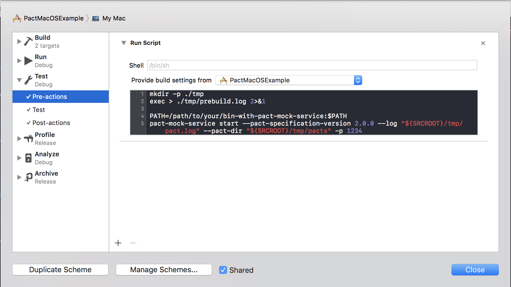

# Pact Consumer Swift

[](https://travis-ci.org/DiUS/pact-consumer-swift)
[](https://codecov.io/gh/DiUS/pact-consumer-swift)
[](https://github.com/Carthage/Carthage)
[]()

[](https://cocoadocs.org/docsets/PactConsumerSwift)
[](https://cocoadocs.org/docsets/PactConsumerSwift) [](https://opensource.org/licenses/MIT)
[](http://twitter.com/pact_up)

This library provides a Swift / Objective C DSL for creating Consumer [Pacts](http://pact.io). It provides support for **[Consumer Driven Contract Testing][pact-microservices]** between dependent systems where the integration is based on HTTP (or message queues for some of the implementations).

_But why?_ To test communication boundaries between your app and services.  
You can view a presentation on how Pact can work in a mobile context here: [Yow! Connected 2016 Andrew Spinks - Increasing The Confidence In Your Service Integrations](https://www.youtube.com/watch?v=UQkMr4bKYp4).

Implements [Pact Specification v2][pact-spec-v2],
including [flexible matching][pact-flexible-matching].

This DSL relies on the Ruby [pact-ruby-standalone][pact-mock-service-standalone] to provide the mock service for the tests.

## Installation
Note: see [Upgrading][upgrading] for notes on upgrading from 0.2 to 0.3

### Install Pact Mock Service

#### Homebrew

    brew tap surpher/pact-ruby-standalone
    brew install pact-ruby-standalone

This will install the following tools:

    pact
    pact-broker
    pact-message
    pact-mock-service
    pact-provider-verifier
    pact-publish
    pact-stub-service
    
#### Manually
Alternatively you can download and install the [pact-ruby-standalone][pact-ruby-standalone-releases] archives for your platform and install as per installation instructions written in [Pact Ruby Standalone release notes][pact-mock-service-standalone-installation].

#### Xcode Setup
In Xcode, edit your scheme and add _pre-_ and _post-actions_ to `Test` to start and stop `pact-mock-service`. Make sure you select your target in _Provide build settings from_ the drop down menu.

```
# Pre-actions
PATH=/path/to/your/standalone/pact/bin:$PATH
pact-mock-service start --pact-specification-version 2.0.0 --log "${SRCROOT}/tmp/pact.log" --pact-dir "${SRCROOT}/tmp/pacts" -p 1234

# Post-actions
PATH=/path/to/your/standalone/pact/bin:$PATH
pact-mock-service stop
```
Note: your generated Pact files will be dropped into `"${SRCROOT}/tmp/pacts"` folder.



### Add the PactConsumerSwift library to your project

#### Using [Carthage](https://github.com/Carthage/Carthage)
- See the [PactSwiftExample][pact-carthage-ios-example] [][build-carthage-ios-example] for an example project using `pact-consumer-swift` with Carthage for an iOS target.
- See the [PactMacOSExample][pact-carthage-macos-example] [][build-carthage-macos-example] for an example project using `pact-consumer-swift` through Carthage for a macOS target.

#### Using [CocoaPods](https://cocoapods.org/pods/PactConsumerSwift)
- See the [PactObjectiveCExample][pact-objc-example] [][build-objc-example] for an example project using `pact-consumer-swift` with CocoaPods for an iOS target.

#### Using [Swift Package Manager](https://swift.org/package-manager/)
- See the [PactSwiftPMExample][pact-swiftpm-example] [][build-swiftpm-example] for an example project using `pact-consumer-swift` library through Swift Package Manager for an executable that runs in terminal.

## Writing Pact Tests

### Testing with Swift
  Write a Unit test similar to the following (NB: this example is using the [Quick](https://github.com/Quick/Quick) test framework)

```swift
import PactConsumerSwift

...
  beforeEach {
    animalMockService = MockService(provider: "Animal Service", consumer: "Animal Consumer Swift")
    animalServiceClient = AnimalServiceClient(baseUrl: animalMockService!.baseUrl)
  }

  it("gets an alligator") {
    animalMockService!.given("an alligator exists")
                      .uponReceiving("a request for an alligator")
                      .withRequest(method:.GET, path: "/alligator")
                      .willRespondWith(status:200,
                                       headers: ["Content-Type": "application/json"],
                                       body: ["name": "Mary"])

    //Run the tests
    animalMockService!.run { (testComplete) -> Void in
      animalServiceClient!.getAlligator { (alligator) in
        expect(alligator.name).to(equal("Mary"))
        testComplete()
      }
    }
  }
```

  An optional `timeout` (seconds) parameter can be included on the run function. This defaults to 30 seconds.

```swift
...
    animalMockService!.run(timeout: 60) { (testComplete) -> Void in
      animalServiceClient!.getAlligator { (alligator) in
        expect(alligator.name).to(equal("Mary"))
        testComplete()
      }
    }
```

### Testing with Objective-C
  Write a Unit test similar to the following

```objc
@import PactConsumerSwift;
...
- (void)setUp {
  [super setUp];
  self.animalMockService = [[MockService alloc] initWithProvider:@"Animal Provider"
                                                        consumer:@"Animal Service Client Objective-C"];
  self.animalServiceClient = [[OCAnimalServiceClient alloc] initWithBaseUrl:self.animalMockService.baseUrl];
}

- (void)testGetAlligator {
  typedef void (^CompleteBlock)();

  [[[[self.animalMockService given:@"an alligator exists"]
                             uponReceiving:@"oc a request for an alligator"]
                             withRequestHTTPMethod:PactHTTPMethodGET
                                              path:@"/alligator"
                                             query:nil headers:nil body:nil]
                             willRespondWithHTTPStatus:200
                                               headers:@{@"Content-Type": @"application/json"}
                                                  body: @"{ \"name\": \"Mary\"}" ];

  [self.animalMockService run:^(CompleteBlock testComplete) {
      Animal *animal = [self.animalServiceClient getAlligator];
      XCTAssertEqualObjects(animal.name, @"Mary");
      testComplete();
  }];
}
```

  An optional `timeout` (seconds) parameter can be included on the run function. This defaults to 30 seconds.

```objc
...
  [self.animalMockService run:^(CompleteBlock testComplete) {
      Animal *animal = [self.animalServiceClient getAlligator];
      XCTAssertEqualObjects(animal.name, @"Mary");
      testComplete();
  } timeout:60];
}
```

### Testing with XCTest
Write a Unit Test similar to the following:
```swift
import PactConsumerSwift
...
  var animalMockService: MockService?
  var animalServiceClient: AnimalServiceClient?

  override func setUp() {
    super.setUp()

    animalMockService = MockService(provider: "Animal Provider", consumer: "Animal Service Client")
    animalServiceClient = AnimalServiceClient(baseUrl: animalMockService!.baseUrl)
  }

  func testItGetsAlligator() {
    // Prepare the expecated behaviour using pact's MockService
    animalMockService!
      .given("an alligator exists")
      .uponReceiving("a request for alligator")
      .withRequest(method: .GET, path: "/alligator")
      .willRespondWith(status: 200,
                       headers: ["Content-Type": "application/json"],
                       body: [ "name": "Mary" ])

    // Run the test
    animalMockService!.run(timeout: 60) { (testComplete) -> Void in
      self.animalServiceClient!.getAlligator { (response) -> in
        XCTAssertEqual(response.name, "Mary")
        testComplete()
      }
    }
  }
  ...
```

An optional `timeout` (seconds) parameter can be included on the run function. Defaults to 30 seconds.

```swift
...
    // Run the test
    animalMockService!.run(timeout: 60) { (testComplete) -> Void in
      self.animalServiceClient!.getAlligator { (response) -> in
        XCTAssertEqual(response.name, "Mary")
        testComplete()
      }
    }
```

### Matching

In addition to verbatim value matching, you have 3 useful matching functions
in the `Matcher` class that can increase expressiveness and reduce brittle test
cases.

* `Matcher.term(matcher, generate)` - tells Pact that the value should match using
a given regular expression, using `generate` in mock responses. `generate` must be
a string.
* `Matcher.somethingLike(content)` - tells Pact that the value itself is not important, as long
as the element _type_ (valid JSON number, string, object etc.) itself matches.
* `Matcher.eachLike(content, min)` - tells Pact that the value should be an array type,
consisting of elements like those passed in. `min` must be >= 1. `content` may
be a valid JSON value: e.g. strings, numbers and objects.

*NOTE*: One caveat to note, is that you will need to use valid Ruby [regular expressions][regular-expressions] and double escape backslashes.

See the `PactSpecs.swift`, `PactObjectiveCTests.m` for examples on how to expect error responses, how to use query params, and Matchers.

For more on request / response matching, see [Matching][matching].

### Using in you CI
Xcode's _pre-actions_ and _post-actions_ do not honour non-zero script exits and therefore would not fail your build if publishing to a Pact Broker would fail. If you would like to upload your Pact files to a Pact Broker as part of your CI, we would suggest that you create a separate step in your CI workflow with that responsibility.

See [pact-ruby-standalone][pact-ruby-standalone-releases] page for installation instructions and how to use `pact-broker` client.

### Verifying your client against the service you are integrating with
If your setup is correct and your tests run against the pack mock server, then you should see a log file here:
`$YOUR_PROJECT/tmp/pact.log`
And the generated pacts here:
`$YOUR_PROJECT/tmp/pacts/...`

[Publish][pact-publish-to-broker] your generated pact file(s) to your [Pact Broker][pact-broker] or a [Hosted Pact Broker](http://pact.dius.com.au) so your _API provider_ can always retrieve them from one location, even when pacts change. Or even just by simply sending the pact file to your API provider devs so they can used them in their tests of their API responses. See [Verifying pacts][pact-verifying] for more information.
For an end-to-end example with a ruby back end service, have a look at the [KatKit example][pact-katkit-example].

Also, check out this article on [using a dockerized Node.js service][pact-dockerized-example] that uses provider states.

## More reading
* The Pact website [Pact](http://pact.io)
* The pact mock server that the Swift library uses under the hood [Pact mock service][pact-mock-service]
* A pact broker for managing the generated pact files (so you don't have to manually copy them around!) [Pact broker][pact-broker]

## Contributing

Please read [CONTRIBUTING.md](/CONTRIBUTING.md)

[upgrading]: https://github.com/DiUS/pact-consumer-swift/wiki/Upgrading
[pact-broker]: https://github.com/pact-foundation/pact_broker
[pact-readme]: https://github.com/realestate-com-au/pact
[pact-verifying]: http://docs.pact.io/documentation/verifying_pacts.html
[pact-spec-v2]: https://github.com/pact-foundation/pact-specification/tree/version-2
[pact-flexible-matching]: http://docs.pact.io/documentation/matching.html
[pact-publish-to-broker]: https://github.com/pact-foundation/pact_broker/wiki/Publishing-and-retrieving-pacts
[pact-katkit-example]: https://github.com/andrewspinks/pact-mobile-preso
[pact-dockerized-example]: https://medium.com/@rajatvig/ios-docker-and-consumer-driven-contract-testing-with-pact-d99b6bf4b09e#.ozcbbktzk
[pact-mock-service]: https://github.com/bethesque/pact-mock_service
[pact-mock-service-standalone]: https://github.com/pact-foundation/pact-ruby-standalone
[pact-ruby-standalone-releases]: https://github.com/pact-foundation/pact-ruby-standalone/releases
[pact-mock-service-without-ruby]: https://github.com/DiUS/pact-consumer-js-dsl/wiki/Using-the-Pact-Mock-Service-without-Ruby
[regular-expressions]: http://ruby-doc.org/core-2.1.5/Regexp.html
[matching]: http://docs.pact.io/documentation/matching.html
[pact-swiftpm-example]: http://github.com/surpher/PactSwiftPMExample
[build-swiftpm-example]: https://travis-ci.org/surpher/PactSwiftPMExample
[pact-objc-example]: https://github.com/andrewspinks/PactObjectiveCExample
[build-objc-example]: https://travis-ci.org/andrewspinks/PactObjectiveCExample
[pact-carthage-macos-example]: https://github.com/surpher/PactMacOSExample
[build-carthage-macos-example]: https://travis-ci.org/surpher/PactMacOSExample
[pact-carthage-ios-example]: https://github.com/andrewspinks/PactSwiftExample
[build-carthage-ios-example]: https://travis-ci.org/andrewspinks/PactSwiftExample
[pact-microservices]: https://dius.com.au/2016/02/03/microservices-pact/
